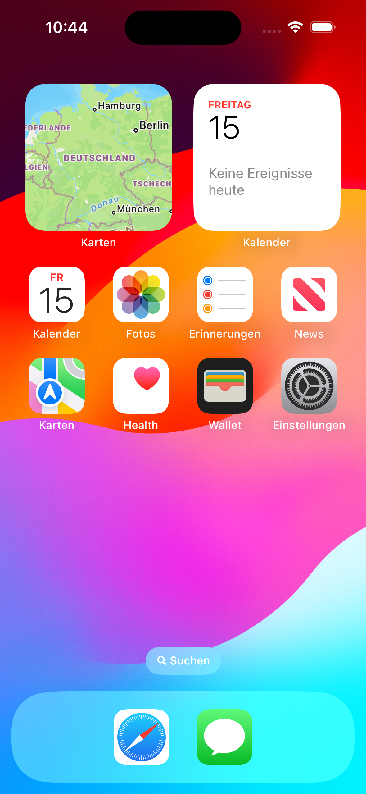

# DishDash

**Schnell, frisch, zu dir nach Haus!**

## Über DishDash
DishDash revolutioniert den Lebensmitteleinkauf mit einer benutzerfreundlichen Liefer-App, die es dir ermöglicht, frische Supermarktwaren direkt an deine Haustür liefern zu lassen. Ob du saftiges Fleisch, knackiges Gemüse oder deine Lieblingssnacks wünschst, DishDash macht es möglich. Diese App ist ideal für alle, die den Komfort eines schnellen und flexiblen Lebensmitteleinkaufs von zuhause aus schätzen.

## Besonderheiten von DishDash
### Integrierter Chatbot
Ein Highlight von DishDash ist unser innovativer Chatbot. Anders als bei herkömmlichen Liefer-Apps, kannst du bei DishDash ein Bild von einem Gericht im Chat hochladen und Stichpunkte dazu schrieben, und unser Bot schlägt dir sofort passende Rezepte vor. So wird dein Einkauf nicht nur einfacher, sondern auch inspirierender. Dieses Feature unterstützt dich dabei, aus dem, was du dir wünscht, ein passendes Rezept zu zaubern.

### Warum DishDash wählen?
DishDash unterscheidet sich von anderen Lieferapps durch die nahtlose Integration von effizienter Logistik, frischen Produkten und benutzerfreundlicher Technologie. Wir bringen den Supermarkt zu dir – schnell, frisch und genau nach deinem Geschmack.

## Mach den ersten Schritt zu einem einfacheren Lebensmitteleinkauf
Lade DishDash herunter und erlebe, wie einfach und angenehm der Einkauf von Lebensmitteln sein kann. Verfügbar für Android und iOS.

## Geplantes Design
Füge hier einige repräsentative Designs deiner App ein (z.B. aus Figma).
Wenn deine App dann so weit ist, dass du echte Screenshots machen kannst, solltest du diese hier einsetzen.

  
  
  

## Features
Hier kommen alle geplanten Features der App rein mit dem Status, ob es bereits umgesetzt wurde.

- [ ] Feature 1
- [ ] Feature 2
- [ ] ...

## Technischer Aufbau

#### Projektaufbau
Eine kurze Beschreibung deiner Ordnerstruktur und Architektur (MVVM, Repositories?) um Außenstehenden zu helfen, sich in deinem Projekt zurecht zu finden.

#### Datenspeicherung
Welche Daten speicherst du? Wo und wie (Firebase, Core Data, etwas anderes)?

#### API Calls
Welche APIs verwendest du?

#### 3rd-Party Frameworks
Verwendest du Frameworks, die nicht von dir stammen? Bspw. Swift Packages für Firebase, fertige SwiftUI-Views o.Ä.? Gib diese hier an.

## Ausblick
Beschreibe hier, wo die Reise nach deinem Praxisprojekt hin geht. Was möchtest du in Zukunft noch ergänzen? Erstelle auch hierzu Issues und verlinke sie, wie oben.
 
